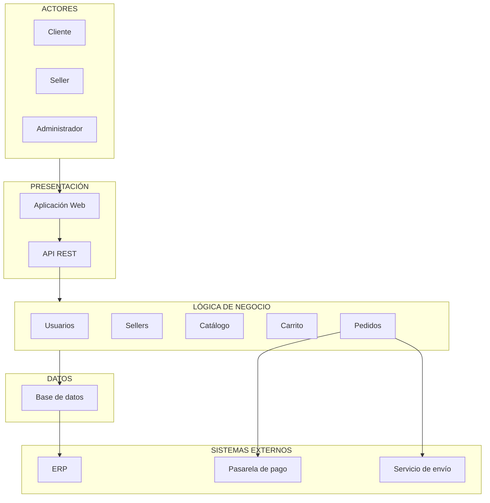

# Arquitectura inicial del sistema

## Arquitectura en tres capas

El Marketplace de productos para mascotas se organiza inicialmente mediante una arquitectura de tres capas, separando las responsabilidades de presentación, lógica de negocio y acceso a datos.

### 1. Capa de Presentación

Esta capa permite la interacción de los usuarios con el sistema.

- Aplicación Web
- API REST

### 2. Capa de Lógica de Negocio

Esta capa contiene las principales funcionalidades y reglas del Marketplace.

- Usuarios
- Sellers
- Catálogo
- Carrito
- Pedidos

### 3. Capa de Datos

Esta capa se encarga del almacenamiento y consulta de la información del sistema.

- Base de datos
## Diagrama de arquitectura

