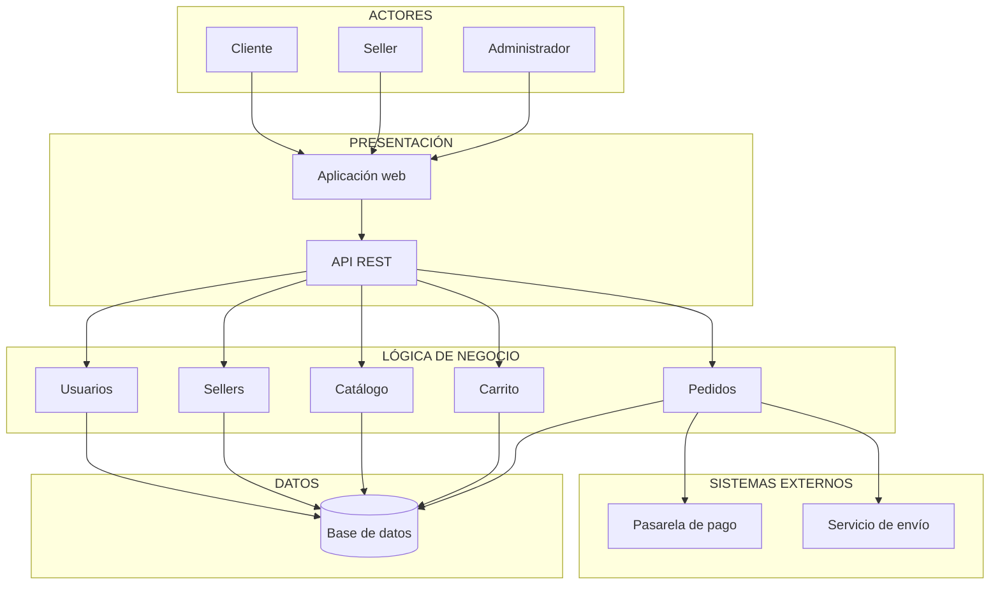

# Arquitectura inicial del marketplace

## Arquitectura en tres capas

| Capa | Responsabilidad | Elementos |
|---|---|---|
| Presentación | Permitir la interacción de los usuarios con el sistema. | Aplicación web y API REST. |
| Lógica de negocio | Ejecutar las funciones y reglas del marketplace. | Usuarios, Sellers, Catálogo, Carrito y Pedidos. |
| Datos | Almacenar y consultar la información del sistema. | Base de datos. |

### Relación entre las capas

1. El cliente, el seller y el administrador utilizan la aplicación web.
2. La aplicación web se comunica con la API REST.
3. La API REST solicita operaciones a los módulos de lógica de negocio.
4. Los módulos de negocio consultan o actualizan la base de datos.

## Diagrama de arquitectura inicial

```mermaid
flowchart TB
    subgraph ACTORES["ACTORES"]
        Cliente["Cliente"]
        Seller["Seller"]
        Admin["Administrador"]
    end

    subgraph PRESENTACION["PRESENTACIÓN"]
        Web["Aplicación web"]
        API["API REST"]
        Web --> API
    end

    subgraph NEGOCIO["LÓGICA DE NEGOCIO"]
        Usuarios["Usuarios"]
        Sellers["Sellers"]
        Catalogo["Catálogo"]
        Carrito["Carrito"]
        Pedidos["Pedidos"]
    end

    subgraph DATOS["DATOS"]
        BD[("Base de datos")]
    end

    subgraph EXTERNOS["SISTEMAS EXTERNOS"]
        Pago["Pasarela de pago"]
        Envio["Servicio de envío"]
    end

    Cliente --> Web
    Seller --> Web
    Admin --> Web

    API --> Usuarios
    API --> Sellers
    API --> Catalogo
    API --> Carrito
    API --> Pedidos

    Usuarios --> BD
    Sellers --> BD
    Catalogo --> BD
    Carrito --> BD
    Pedidos --> BD

    Pedidos --> Pago
    Pedidos --> Envio
```

### Descripción

La aplicación web y la API REST forman la capa de presentación. Los módulos Usuarios, Sellers, Catálogo, Carrito y Pedidos forman la lógica de negocio. La base de datos almacena la información del marketplace. El módulo Pedidos se comunica con la pasarela de pago y el servicio de envío, que son sistemas externos.