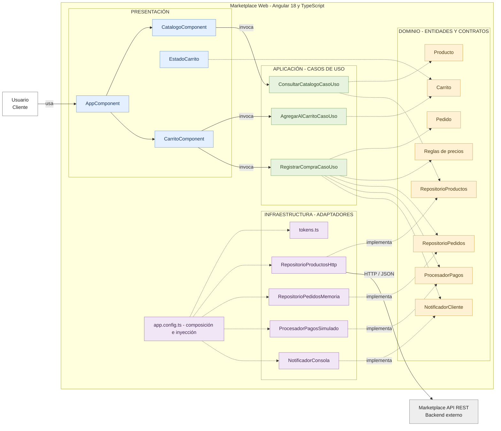

# Enfoque arquitectónico: Clean Architecture

## Enfoque seleccionado

| Elemento | Descripción aplicada al marketplace |
|---|---|
| Patrón o enfoque | Clean Architecture (Arquitectura Limpia). |
| Objetivo | Separar responsabilidades y dirigir las dependencias hacia el dominio. |
| Problema que resuelve | Evita que las reglas de negocio dependan directamente de Angular, la API REST o los servicios externos. |
| Capas | Presentación, Aplicación, Dominio e Infraestructura. |
| Beneficios | Facilita las pruebas, el mantenimiento y el cambio de implementaciones técnicas. |

## Diagrama del enfoque

## Regla de dependencia

Las dependencias del código apuntan hacia el interior: presentación e infraestructura pueden depender de aplicación y dominio, pero el dominio no depende de Angular, HTTP ni implementaciones concretas. Los casos de uso trabajan con contratos; los adaptadores de infraestructura implementan esos contratos.

`app.config.ts` selecciona e inyecta los adaptadores concretos. Por ello, cambiar un adaptador no exige modificar las entidades y reglas del dominio.