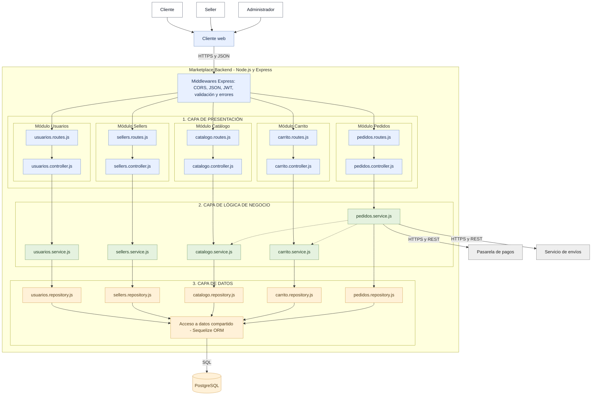

# Estilo arquitectónico del marketplace

## Estilo seleccionado

Se propone un monolito modular. Los módulos de Usuarios, Sellers, Catálogo, Carrito y Pedidos funcionan dentro de una misma aplicación, pero cada uno mantiene separadas sus responsabilidades. El backend se organiza en las capas de presentación, lógica de negocio y datos.

## Diagrama de arquitectura

## Justificación

El monolito modular permite desplegar el backend como una sola aplicación y mantener organizadas las funciones por módulo. La capa de presentación recibe las solicitudes, la lógica de negocio aplica las reglas del marketplace y la capa de datos gestiona la persistencia. La pasarela de pagos y el servicio de envíos permanecen como sistemas externos.